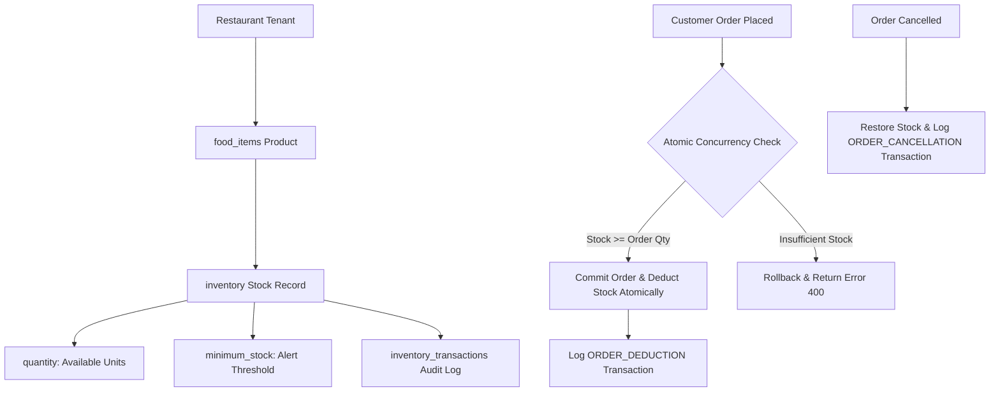

# FastBite Restaurant Inventory Management — Phase 9 Technical Documentation

## 1. Overview
Phase 9 introduces a multi-tenant, concurrency-safe **Restaurant Inventory Management System** (`/admin/inventory`). Each restaurant owner and authorized staff member can monitor real-time stock levels, configure low-stock warning thresholds, adjust stock levels with audit reasons, view transaction logs, and automatically deduct stock on customer order placement while restoring stock on order cancellation.

---

## 2. Inventory Entity Relationship & Data Flow



---

## 3. Database Schema

### `inventory`
```sql
CREATE TABLE IF NOT EXISTS inventory (
  id INT AUTO_INCREMENT PRIMARY KEY,
  product_id INT NOT NULL UNIQUE,
  restaurant_id INT NOT NULL DEFAULT 1,
  quantity INT NOT NULL DEFAULT 50,
  minimum_stock INT NOT NULL DEFAULT 5,
  created_at TIMESTAMP DEFAULT CURRENT_TIMESTAMP,
  updated_at TIMESTAMP DEFAULT CURRENT_TIMESTAMP ON UPDATE CURRENT_TIMESTAMP,
  FOREIGN KEY (product_id) REFERENCES food_items(id) ON DELETE CASCADE,
  FOREIGN KEY (restaurant_id) REFERENCES restaurants(id) ON DELETE CASCADE
);
```

### `inventory_transactions`
```sql
CREATE TABLE IF NOT EXISTS inventory_transactions (
  id INT AUTO_INCREMENT PRIMARY KEY,
  inventory_id INT NOT NULL,
  product_id INT NOT NULL,
  restaurant_id INT NOT NULL DEFAULT 1,
  type VARCHAR(30) NOT NULL, -- ORDER_DEDUCTION | ORDER_CANCELLATION | RESTOCK | MANUAL_ADJUSTMENT
  quantity INT NOT NULL,
  previous_quantity INT NOT NULL,
  new_quantity INT NOT NULL,
  reason VARCHAR(255) NULL,
  order_id INT NULL,
  user_id INT NULL,
  created_at TIMESTAMP DEFAULT CURRENT_TIMESTAMP,
  FOREIGN KEY (inventory_id) REFERENCES inventory(id) ON DELETE CASCADE,
  FOREIGN KEY (product_id) REFERENCES food_items(id) ON DELETE CASCADE,
  FOREIGN KEY (restaurant_id) REFERENCES restaurants(id) ON DELETE CASCADE
);
```

---

## 4. API Endpoints

| Method | Endpoint | Access | Purpose |
|---|---|---|---|
| `GET` | `/api/inventory` | `VIEW_INVENTORY` | Paginated, searchable, status-filterable (`in_stock`, `low_stock`, `out_of_stock`) inventory list for tenant. |
| `GET` | `/api/inventory/summary` | `VIEW_INVENTORY` | Summary KPI cards data (`totalProducts`, `inStock`, `lowStock`, `outOfStock`). |
| `PUT` | `/api/inventory/:productId` | `MANAGE_INVENTORY` | Update product stock quantity, minimum stock threshold, and audit reason. |
| `GET` | `/api/inventory/:productId/history` | `VIEW_INVENTORY` | Transaction history logs for a product. |
| `GET` | `/api/inventory/history` | `VIEW_INVENTORY` | Tenant-wide inventory audit logs. |

---

## 5. Concurrency & Security Rules

- **Atomic Stock Deduction Query**:
  ```sql
  UPDATE inventory 
  SET quantity = quantity - ? 
  WHERE product_id = ? AND restaurant_id = ? AND quantity >= ?;
  ```
  If `affectedRows === 0`, order is rolled back and HTTP 400 is returned preventing overselling.
- **Tenant Isolation**: Every SQL query includes `restaurant_id = ?` derived from authenticated user token.
- **RBAC Enforcements**: Restricted to `SUPER_ADMIN`, `RESTAURANT_OWNER`, and `MANAGER` roles.
- **Customer Storefront Display**: Products with `quantity === 0` display `"Out of Stock"` with disabled `"Add to Cart"` buttons. Low stock products (`quantity <= minimum_stock`) display `"Only a few left"` badges.
