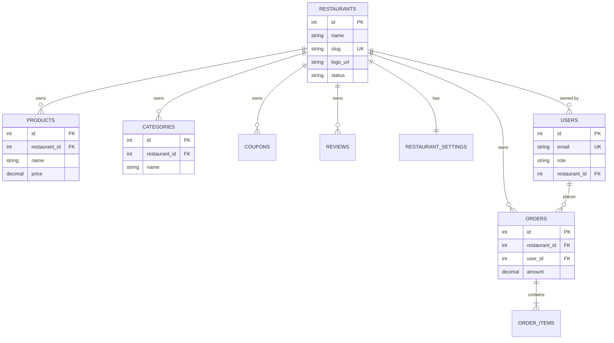

# FastBite Multi-Tenant SaaS Architecture — Phase 1 Documentation

## 1. Overview
FastBite has been upgraded from a single-restaurant application to a **multi-tenant food delivery SaaS platform**. Every restaurant business entity operates with complete data isolation across products, categories, orders, coupons, reviews, analytics, and settings.

---

## 2. Multi-Tenant Database Schema

### Tenant-Scoped Tables
1. **`restaurants`**: Central restaurant profiles (`id`, `name`, `slug` UNIQUE, `logo_url`, `status`).
2. **`users`**:
   - Restaurant Owners: `role = 'admin'` or `'restaurant_owner'`, `restaurant_id` = `<RESTAURANT_ID>`.
   - Customers: `role = 'customer'`, `restaurant_id = NULL` (can order across multiple restaurants).
3. **`food_items`**: `restaurant_id` (Products owned by a specific restaurant).
4. **`categories`**: `restaurant_id` (Categories unique per restaurant, composite UNIQUE `(restaurant_id, name)`).
5. **`orders`**: `restaurant_id` (Customer orders scoped to a single restaurant).
6. **`coupons`**: `restaurant_id` (Promotional codes unique per restaurant, composite UNIQUE `(restaurant_id, code)`).
7. **`restaurant_settings`**: `restaurant_id` (Restaurant configuration & UPI payment details).
8. **`reviews`**: `restaurant_id` (Customer product reviews for moderation).

*Note: `order_items` derives its tenant scope via `order_id -> orders -> restaurant_id`.*

---

## 3. Tenant Context Resolution & Security
- **Authentication**: JWT token carries `req.userId`.
- **Tenant Context Resolution**: `authMiddleware` and `adminMiddleware` fetch `restaurant_id` from the database `users` table upon JWT verification.
- **Client Non-Trust Rule**: The backend **never** trusts client-supplied `restaurantId` values in request bodies for authorization. All admin operations execute against `req.restaurantId`.
- **IDOR Protection**: All admin endpoints (`GET`, `POST`, `PUT`, `DELETE`) enforce `WHERE restaurant_id = req.restaurantId`. Accessing another restaurant's record yields `403 Forbidden` / `404 Not Found`.

---

## 4. Single-Restaurant Cart & Order Isolation
- **Cart Validation**: When a customer adds a product, the backend checks for existing cart items. If items belong to another restaurant, the API returns a `409 Conflict` prompting the customer to clear their cart.
- **Order Validation**: `placeOrder` validates that all items in an order belong to the same restaurant before transaction commit.

---

## 5. Backward Compatibility & Data Migration
- All pre-existing production data was automatically migrated to **Initial Restaurant** (`id = 1`, `slug = 'fastbite'`).
- Public customer APIs default to `restaurant_id = 1` if no explicit `restaurant_id` or `slug` is provided.

---

## 6. Future Multi-Tenant Roadmap (Phase 2+)
- **Super Admin Dashboard**: Multi-tenant platform management.
- **SaaS Subscriptions & Billing**: Razorpay/Stripe automated recurring plans.
- **Staff Roles & Granular Permissions**: Multi-user restaurant staff.
