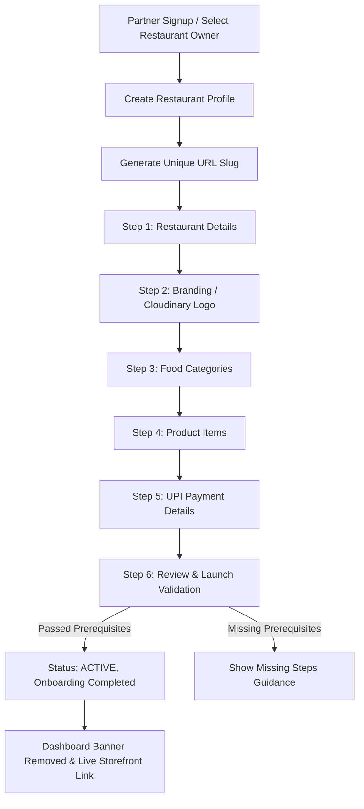

# FastBite Self-Service Restaurant Onboarding — Phase 3 Technical Documentation

## 1. Overview
Phase 3 introduces a complete self-service **Restaurant Onboarding & Setup Wizard** for FastBite SaaS. It allows new restaurant partners to register an account, create their restaurant, configure branding, set up categories and initial menu items, configure UPI payment options, and launch their store without manual database configuration.

---

## 2. Onboarding Workflow



---

## 3. Database Schema Extensions

### `restaurants` Table
```sql
ALTER TABLE restaurants ADD COLUMN city VARCHAR(100);
ALTER TABLE restaurants ADD COLUMN state VARCHAR(100);
ALTER TABLE restaurants ADD COLUMN pincode VARCHAR(20);
ALTER TABLE restaurants ADD COLUMN onboarding_step INT DEFAULT 1;
ALTER TABLE restaurants ADD COLUMN onboarding_completed BOOLEAN DEFAULT FALSE;
```

- **Status Values**: `'setup'` (in-progress onboarding), `'active'` (live storefront), `'inactive'` (disabled).
- **Default Migration Backfill**: Initial restaurant `id = 1` (`fastbite`) is set to `status = 'active'`, `onboarding_step = 6`, `onboarding_completed = TRUE`.

---

## 4. API Endpoint Specifications

| Endpoint | Method | Role | Description |
|---|---|---|---|
| `/api/restaurant/create` | `POST` | `restaurant_owner`, `super_admin` | Creates new restaurant, generates unique slug, stamps `users.restaurant_id`, and sets `status = 'setup'`. |
| `/api/restaurant/me` | `GET` | Authenticated Staff | Fetches authenticated owner's restaurant details, settings, category/product stats, and onboarding step. |
| `/api/restaurant/me/onboarding` | `PUT` | `restaurant_owner`, `super_admin` | Updates store details, UPI ID, and persists `onboarding_step`. |
| `/api/restaurant/me/logo` | `POST` | `restaurant_owner`, `super_admin` | Uploads restaurant logo to Cloudinary folder `FastBite/restaurant_<id>/logo`. |
| `/api/restaurant/me/launch` | `POST` | `restaurant_owner`, `super_admin` | Validates launch prerequisites (store info, $\ge 1$ category, $\ge 1$ product, UPI ID) and activates store status. |

---

## 5. Launch Prerequisite Validation

The `/api/restaurant/me/launch` endpoint enforces server-side validation:
1. **Restaurant Name & Info**: Must be configured.
2. **Categories**: Must have $\ge 1$ active category in `categories` table for `restaurant_id`.
3. **Products**: Must have $\ge 1$ active food item in `food_items` table for `restaurant_id`.
4. **Payment**: Must have valid `upi_id` in `restaurant_settings` table for `restaurant_id`.

If any condition fails, HTTP 400 is returned with a specific list of incomplete steps.

---

## 6. Cloudinary Storage Structure
- **Logo Storage**: Uploaded via memory buffer to `FastBite/restaurant_<tenant_id>/logo`.
- **Product Images**: Stored in `FastBite/restaurant_<tenant_id>/products`.
- **Secret Isolation**: Cloudinary API secrets are executed strictly inside backend controllers (`cloudinary.js`).

---

## 7. Security & IDOR Verification
- **Authenticated Identity**: User identity (`req.userId`, `req.restaurantId`) is extracted from verified JWT tokens.
- **Tenant Scope**: Restaurant owners can only modify their own assigned restaurant (`WHERE id = req.restaurantId`).
- **Owner Limit**: Users with an existing `restaurant_id` are prevented from creating secondary restaurants in Phase 3.
