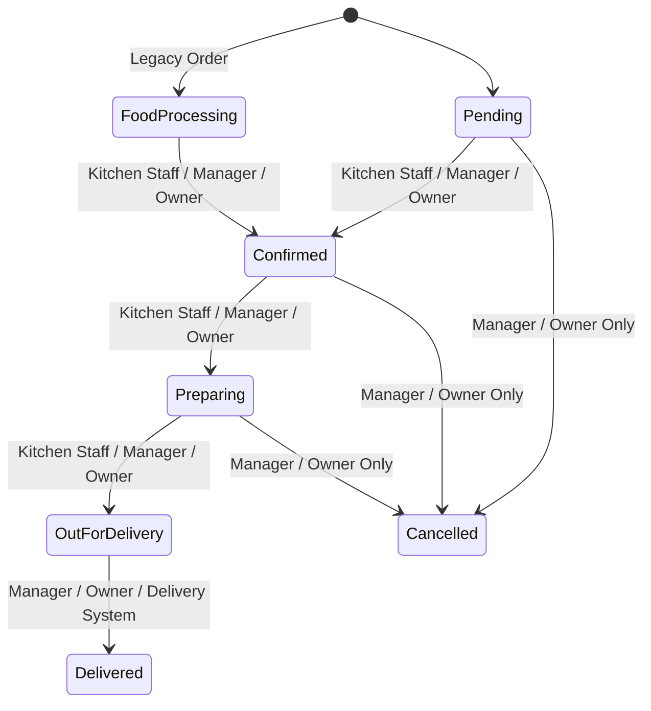

# FastBite Role-Based Access Control (RBAC) & Permissions — Phase 2 Documentation

## 1. Overview
FastBite Phase 2 establishes a backend-enforced **Role-Based Access Control (RBAC)** architecture combined with Phase 1 **Tenant Data Isolation**. User authorization is evaluated against both the user's assigned role and their associated restaurant ID (`req.restaurantId`).

---

## 2. Roles Overview

| Role | System Identifier | Scope | Description |
|---|---|---|---|
| **Super Admin** | `super_admin` | Global Platform | SaaS platform administrator with unrestricted cross-tenant capabilities foundation. |
| **Restaurant Owner** | `restaurant_owner` | Single Restaurant | Full administrative authority over their assigned restaurant (settings, payments, staff, catalog, orders, coupons, analytics). |
| **Manager** | `manager` | Single Restaurant | Operational manager for products, categories, orders, coupons, customer listings, and analytics. Excludes store/UPI settings & staff role management. |
| **Kitchen Staff** | `kitchen_staff` | Single Restaurant | Dedicated kitchen order workflow role. Can view active orders and update kitchen preparation statuses. |
| **Customer** | `customer` | Global Customer | End-user account. Can browse menus, manage personal cart, place orders, view order history, and submit product reviews. |

---

## 3. Permissions Matrix

| Permission Code | Description | Super Admin | Owner | Manager | Kitchen | Customer |
|---|---|:---:|:---:|:---:|:---:|:---:|
| `VIEW_DASHBOARD` | Access admin dashboard stats | ✅ | ✅ | ✅ | ✅ | ❌ |
| `VIEW_PRODUCTS` | View admin product list | ✅ | ✅ | ✅ | ❌ | Public |
| `MANAGE_PRODUCTS` | Create, update, delete products | ✅ | ✅ | ✅ | ❌ | ❌ |
| `VIEW_CATEGORIES` | View category management | ✅ | ✅ | ✅ | ❌ | Public |
| `MANAGE_CATEGORIES` | Create, update, delete categories | ✅ | ✅ | ✅ | ❌ | ❌ |
| `VIEW_ORDERS` | View restaurant order management | ✅ | ✅ | ✅ | ✅ | Own only |
| `UPDATE_ORDER_STATUS` | Update order status transitions | ✅ | ✅ | ✅ | Allowed transitions | ❌ |
| `VIEW_CUSTOMERS` | View registered customer list | ✅ | ✅ | ✅ | ❌ | Profile |
| `MANAGE_CUSTOMERS` | Activate/deactivate customer accounts | ✅ | ✅ | ❌ | ❌ | ❌ |
| `VIEW_COUPONS` | View promotional coupons | ✅ | ✅ | ✅ | ❌ | Public validate |
| `MANAGE_COUPONS` | Create, edit, delete coupons | ✅ | ✅ | ✅ | ❌ | ❌ |
| `VIEW_REVIEWS` | View product reviews for moderation | ✅ | ✅ | ✅ | ❌ | Public |
| `MANAGE_REVIEWS` | Toggle review visibility / delete | ✅ | ✅ | ✅ | ❌ | Own reviews |
| `VIEW_ANALYTICS` | View revenue, sales & customer charts | ✅ | ✅ | ✅ | ❌ | ❌ |
| `MANAGE_RESTAURANT_SETTINGS` | Update name, logo, times, fee | ✅ | ✅ | ❌ | ❌ | ❌ |
| `MANAGE_PAYMENT_SETTINGS` | Update UPI ID, QR code & approve UTR | ✅ | ✅ | ❌ | ❌ | ❌ |
| `MANAGE_STAFF` | Manage restaurant staff accounts | ✅ | ✅ | ❌ | ❌ | ❌ |
| `SUPER_ADMIN_ACCESS` | Global platform tenant switching | ✅ | ❌ | ❌ | ❌ | ❌ |

---

## 4. Kitchen Staff Status Transition Workflow

Kitchen staff are restricted to operational order preparation transitions to prevent unauthorized financial or cancellation overrides:

- **Kitchen Staff Allowed**:
  - `Pending` / `Food Processing` $\rightarrow$ `Confirmed`, `Preparing`
  - `Confirmed` $\rightarrow$ `Preparing`
  - `Preparing` $\rightarrow$ `Out for Delivery`
- **Kitchen Staff Prohibited**:
  - Direct transition to `Delivered` or `Cancelled`
  - Payment approvals or rejections

---

## 5. Security & IDOR Verification

All backend endpoints enforce **dual-check authorization**:
1. **Permission Check**: `requirePermission(PERMISSIONS.XXXX)` verifies the authenticated `req.userRole` possesses the required permission.
2. **Tenant Scoping**: All SQL queries append `WHERE restaurant_id = req.restaurantId` (or `user_id = req.userId` for customer endpoints). Attempting cross-tenant access yields `403 Forbidden` or `404 Not Found`.

---

## 6. Frontend Security Layer
- **Route Protection**: `<ProtectedAdminRoute requiredPermission="...">` verifies permissions before rendering chunked admin components. Unauthorized navigation renders the stylized `<AccessDenied />` (403 Forbidden) page.
- **Sidebar Filtering**: Admin sidebar dynamically renders navigation items using `hasPermission(item.permission)`.
- **Client Non-Trust**: The backend re-verifies JWT, user role, and tenant ID on every API request.
