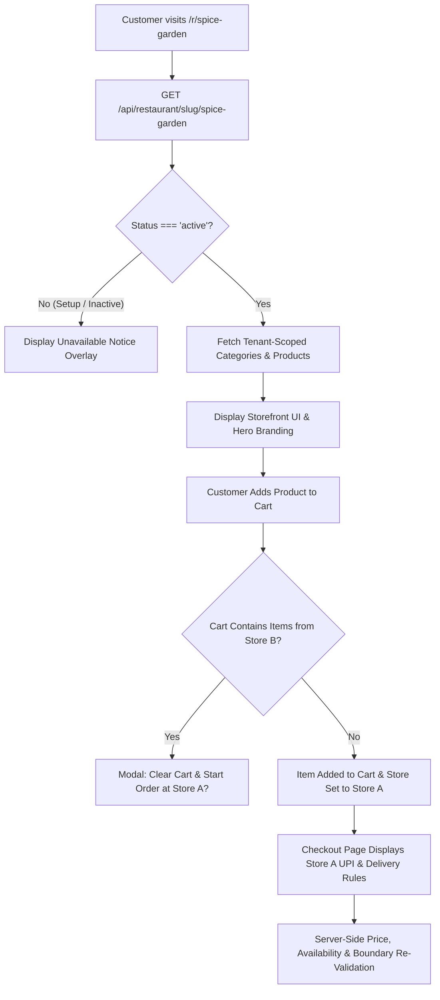

# FastBite Restaurant-Specific Storefront — Phase 4 Technical Documentation

## 1. Overview
Phase 4 introduces tenant-isolated, slug-based public restaurant storefronts (`/r/:slug`). Every active restaurant receives its own dedicated public storefront featuring its branding, logo, contact details, delivery fee, min order requirements, category catalog, products, reviews, and UPI payment setup.

---

## 2. Public Storefront Architecture

---

## 3. Public API Endpoints

| Method | Endpoint | Access | Purpose |
|---|---|---|---|
| `GET` | `/api/restaurant/slug/:slug` | Public | Resolves store details, Cloudinary logo, address, contact, rating ⭐, review count, delivery fee, min order, and status. |
| `GET` | `/api/categories?slug=:slug` | Public | Returns active categories belonging strictly to the specified restaurant. |
| `GET` | `/api/food/list?slug=:slug` | Public | Returns active menu items belonging strictly to the specified restaurant. |
| `GET` | `/api/reviews?slug=:slug` | Public | Returns visible reviews for products belonging strictly to the specified restaurant. |

---

## 4. Single-Restaurant Cart Boundary Rules

- **Client-Side Conflict Detection (`StoreContext.jsx`)**:
  - `cartRestaurant` is maintained alongside `cartItems`.
  - When adding an item from Store B while the cart contains items from Store A, a prompt offers: *"Clear Cart & Start Order"*.
- **Server-Side Boundary Validation (`orderController.js`)**:
  - The `placeOrder` controller queries DB prices and `restaurant_id` for every food item.
  - If food items belong to different restaurants, HTTP 400 (`All items in a single order must belong to the same restaurant`) is returned.

---

## 5. Security & Privacy Guarantees

- **Tenant Isolation**: Restaurant A cannot inspect or modify Restaurant B products, categories, orders, or payment settings.
- **Price Manipulation Protection**: Frontend total and subtotal amounts are ignored; prices are recalculated on the backend directly from `food_items.price`.
- **Availability Enforcement**: `food_items.available` is verified server-side prior to order creation.
- **Customer Data Privacy**: Public storefront APIs expose only public store metadata and reviews, never customer PII or private administrative credentials.
